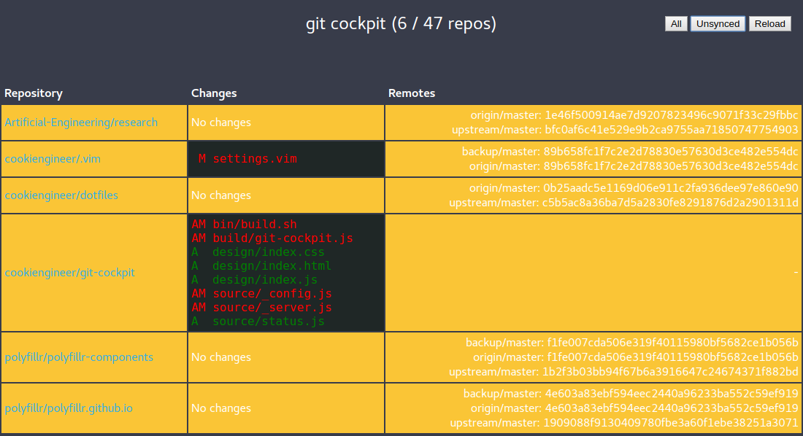

# git cockpit

Quick overview of local git repositories.


## Overview

This project aims to offer a quick overview of a developer's machine
and his repositories. As a typical developer has multiple repositories
in his development folders, it's very hard to have everything
up-to-date and in sync with its remotes.

`git cockpit` tries to ease that up, by offering a quick overview of
all repositories and by highlighting the ones with changes and/or
unsynced remotes.





## Requirements

- `node` (node.js) with ES2016 support
- `git` available at `/usr/bin/git`


## Installation

The installation process is quite simple. There are two
ways to do it:

1. Download this repository, extract its contents and
   create a symbolic link from `/usr/bin/git-cockpit`
   to the `./build/git-cockpit.js` file.

2. Install the `git-cockpit` package via NPM globally.
   Don't worry, this project has zero dependencies.

```bash
npm install -g git-cockpit;
```


## Default Parameters

- Default `port` is `1337`
- Default development root folder is `~/Software`

## Usage

`git cockpit` will find repositories with two-levels of hierarchies,
so it is assumed that you have an `<orga>/<repo>` structure - but it
is no must, and it will work with a one-level hierarchy just fine.

```bash
git cockpit ~/Software --port=13337;

git cockpit ~/Development;
git cockpit /opt/backup/repos;
```

## License

`git cockpit` is (c) 2016-2017 by [Cookie Engineer](https://github.com/cookiengineer)
and released under MIT / Expat license. For further details take a look at the
[LICENSE.txt](LICENSE.txt) file.

